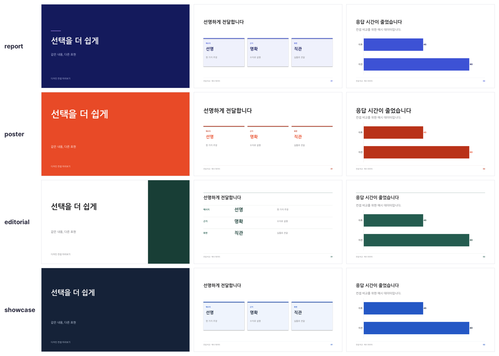

<h1 align="center">Deck Builder Skill</h1>

<p align="center">
  <b>English</b> · <a href="README.ko.md">한국어</a>
</p>

<p align="center">
  Turn structured content into polished, editable PowerPoint decks.<br/>
  Choose the right slide form, generate PPTX, export PDF, and verify embedded fonts in one workflow.
</p>

<p align="center">
  <a href="https://github.com/So-Yul-e/deck-builder-skill/actions/workflows/ci.yml"></a>
  <a href="LICENSE"></a>
</p>

<p align="center">
  <b>macOS validated</b> · <b>Windows adapter beta</b> · Claude and Codex compatible
</p>

<p align="center">
  
</p>

<p align="center">
  <a href="examples/output/deck-builder-catalog.pptx">Editable 20-slide PPTX</a> ·
  <a href="examples/output/deck-builder-catalog.pdf">Validated 20-page PDF</a> ·
  <a href="examples/output/deck-builder-catalog-contact-sheet.png">Full-size contact sheet</a>
</p>

---

## What You Can Make

Use the skill for a new deck or to clean up an existing `.pptx` without flattening
it into images.

| Deck-level use case | Examples |
|---|---|
| Strategy and proposals | business plan, product strategy, option comparison, go/no-go recommendation |
| Reports and roadmaps | executive report, project status, milestones, delivery roadmap |
| Data storytelling | KPI review, survey results, composition, progress, positioning matrix |
| Product and case studies | feature narrative, before/after, screenshots, customer voice, outcomes |
| Explanatory material | process guide, hierarchy, definitions, training or workshop deck |
| Existing deck cleanup | title hierarchy, internal padding, border noise, visual consistency |

The committed catalog covers **20 representative slide types**. They are backed
by 18 of the 19 reusable builder methods; `chart()` produces three catalog forms.

| Content relationship | Slide types |
|---|---|
| Narrative and emphasis | cover, section, statement, quote, hero stat |
| Structure and decisions | bullets, cards, table, definition list, tree, flow, timeline, compare, gate |
| Data and status | bar chart, column chart, donut chart, progress, matrix |
| Visual evidence | screenshots and result artifacts |

`bullets()` is deliberately the fallback, not the default. A process becomes a
flow, dates become a timeline, composition becomes a donut, and pass/fail criteria
become a gate.

## Why This Exists

LLM-generated decks often collapse every idea into bullet lists. Typography then
drifts, layouts lose hierarchy, and PDF export silently substitutes fonts. The
result may be editable, but it is not presentation-ready.

This skill turns deck creation into a repeatable contract: identify the content
relationship, select one primary builder, create an editable PPTX, render it, and
reject the result if the required fonts are not embedded.

## Quick Start

### 1. Install the skill

macOS for Claude:

```bash
git clone https://github.com/So-Yul-e/deck-builder-skill.git
cd deck-builder-skill
mkdir -p ~/.claude/skills
ln -s "$(pwd)/deck" ~/.claude/skills/deck
```

Windows PowerShell for Claude:

```powershell
git clone https://github.com/So-Yul-e/deck-builder-skill.git
$repo = (Resolve-Path ".\deck-builder-skill").Path
$target = "$HOME\.claude\skills\deck"
New-Item -ItemType Directory -Force $target | Out-Null
Copy-Item -Recurse -Force "$repo\deck\*" $target
```

Codex uses the same `deck/` payload. Link or copy it to
`~/.codex/skills/deck` on macOS or `$HOME\.codex\skills\deck` on Windows.
The shared workflow lives in [`deck/SKILL.md`](deck/SKILL.md), while
[`deck/agents/openai.yaml`](deck/agents/openai.yaml) supplies Codex-facing metadata.

### 2. Run the runtime check

The check reports what is missing without installing anything. Run `--install`
only after reviewing the Python, font, and renderer changes.

macOS:

```bash
bash ~/.claude/skills/deck/scripts/deps-macos.sh --check
bash ~/.claude/skills/deck/scripts/deps-macos.sh --install
```

Windows beta:

```powershell
powershell -ExecutionPolicy Bypass -File "$HOME\.claude\skills\deck\scripts\deps-windows.ps1" -Check
powershell -ExecutionPolicy Bypass -File "$HOME\.claude\skills\deck\scripts\deps-windows.ps1" -Install
```

### 3. Ask the agent for a deck

Example requests:

```text
Use $deck to turn this business plan into a 10-slide investor presentation.

Use $deck to create an executive project report with a roadmap, KPIs, and release gate.

Use $deck to polish this PPTX without changing its content or moving its layout boxes.
```

## Visual Concepts

Four concepts share the same builders and content: `report` (default), `poster`, `editorial`, and `showcase`. Typography, color, and card treatment change; the claims do not. For a new deck the agent renders cover, body, and data previews in up to three concepts and waits for your choice. Naming a concept or asking for automatic selection skips this step.

<p align="center">
  
</p>

Reproduce the previews with `python3 examples/build_concept_previews.py`. It writes one PPTX per concept to `examples/output/concepts/`. See [concept guidance](deck/references/concepts.md).

## Image Directions and Updates

**Image generation is optional.** Prefer the user's photographs, product assets,
screenshots, and existing images with verified reuse terms. Generate only when the
user requests it or chooses generation because suitable assets are unavailable.
Use editable text, diagrams, or truthful charts when imagery does not help.

Create 2–3 previews using subject-specific photographs, screenshots, or generated illustrations, with different compositions and the same underlying claims. See [imagery guidance](deck/references/imagery.md) and [the comparison example](examples/build_image_direction_previews.py). Image generation depends on the host's available tools.

For an official clone-and-link installation, enable updates once:

```bash
python3 deck/scripts/update_skill.py --enable
python3 deck/scripts/update_skill.py --check
python3 deck/scripts/update_skill.py --disable
```

The skill checks for updates when invoked, with remote checks limited to once per hour. Only clean official `main` checkouts can fast-forward; local edits, divergence, other branches, and offline states skip updating. On Windows use `py -3` or `python`. Copied installations require reinstalling or migrating to a linked clone. Existing installations need one manual refresh to acquire the updater. No global session hook is installed. See [update boundaries](deck/references/updates.md).

Current Codex documentation uses `~/.agents/skills` for user skills and supports linked folders; retain an existing compatible installation path where your host requires it. [Official skill documentation](https://learn.chatgpt.com/docs/build-skills).

## How It Works

```text
Source content
    ↓ identify the relationship
One primary slide builder
    ↓
Editable PPTX
    ↓ macOS or Windows render adapter
PDF
    ↓ font and fallback verification
Deliverable or fail-closed rejection
```

The model decides the message and relationship. The builder owns spacing,
typography, hierarchy, and shape construction. That division keeps the deck
editable while reducing arbitrary layout decisions.

### Minimal Python example

```python
import sys
sys.path.insert(0, "deck/scripts")

from deck import Deck

d = Deck(palette="indigo", footer="Project · Team")
d.cover("Quarterly Review", "What changed and what we do next", "2026 Q3")
d.cards("Top metrics", [
    ("Activation", "42%", "+8pp"),
    ("Latency", "0.8s", "P95"),
])
d.flow("Delivery flow", [
    ("Scope", "decide"),
    ("Build", "generate"),
    ("Verify", "render"),
])
d.save("review.pptx")
```

Built-in palettes are `indigo`, `navy`, and `mono`. Projects with an existing
design system can pass a palette dictionary instead of inventing new colors.

## Key Decisions

The differentiator is not only what was built, but which failure modes were
intentionally excluded.

| Decision | Rejected alternative | Impact and evidence |
|---|---|---|
| Select form before writing slide text | Default every slide to bullets | The builder routing table and hard limits live in [`deck/SKILL.md`](deck/SKILL.md); the [20-type catalog](examples/build_catalog.py) proves the available forms. |
| Keep one shared deck engine | Fork separate macOS and Windows builder repos | [`deck.py`](deck/scripts/deck.py) stays the source of truth; only dependency and render adapters vary by OS. This prevents visual behavior from drifting. |
| Bundle Pretendard Regular and Bold | Assume the target computer already has the font | OS installers use the bundled OFL assets, and [`verify_pdf_fonts.py`](deck/scripts/verify_pdf_fonts.py) rejects missing embedding and narrow fallback fonts. The cost is about 3 MB of font assets in the repository. |
| Make render verification part of delivery | Treat successful PPTX generation as completion | macOS rendering, PowerPoint/LibreOffice adapters, PDF checks, and committed artifacts expose clipping or substitution before handoff. |

## Current Validation

| Check | Result | Evidence |
|---|---|---|
| Automated contract suite | 29 tests PASS locally on macOS | Package, licensing, PDF, composition, and updater checks in [`tests/`](tests). Previous CI results: [GitHub Actions](https://github.com/So-Yul-e/deck-builder-skill/actions/workflows/ci.yml) |
| Builder coverage | 20 unique catalog pages | [`examples/build_catalog.py`](examples/build_catalog.py) asserts the exact page count |
| PDF geometry | 20 pages, 16:9 | [Committed PDF](examples/output/deck-builder-catalog.pdf) is `959.981 × 540 pt` |
| PDF typography | Pretendard Regular/Bold embedded; Arial Narrow and STHeiti rejected | [`verify_pdf_fonts.py`](deck/scripts/verify_pdf_fonts.py) and [font regression tests](tests/test_pdf_verifier.py) |
| macOS runtime | Validated | Isolated Python environment, LibreOffice path, PowerPoint fallback, and `pdffonts` preflight |
| Windows package path | CI PASS, adapter beta | `windows-latest` rebuilds the 20-page PPTX and runs [`test_windows_scripts.ps1`](tests/test_windows_scripts.ps1) |

Run the repository-contained checks:

```bash
python3 -m unittest discover -s tests -p 'test_*.py'
pwsh -NoProfile -File tests/test_windows_scripts.ps1
bash deck/scripts/deps-macos.sh --check
```

Render and verify the catalog on macOS:

```bash
DECK_PY="$(bash deck/scripts/deps-macos.sh --python)"
"$DECK_PY" examples/build_catalog.py examples/output/deck-builder-catalog.pptx
bash deck/scripts/render-macos.sh \
  examples/output/deck-builder-catalog.pptx \
  examples/output/deck-builder-catalog.pdf
```

## Creator, Role, and Evidence

| Item | Detail |
|---|---|
| Creator | 윤소율 (So-Yul) |
| Role | Workflow design, visual-system rules, implementation, packaging, and render QA |
| Team | One-person project with AI-assisted implementation and independent AI review |
| Period | 2026-08-04 to 2026-08-07 |

This repository packages So-Yul's existing personal deck workflow as a public,
portable skill. Human ownership covers the problem framing, builder-selection
rules, portability decisions, acceptance criteria, and release judgment; AI was
used as an implementation and review lever.

| Responsibility axis | Concrete evidence |
|---|---|
| Workflow planning | [`deck/SKILL.md`](deck/SKILL.md) defines routing, builder selection, hard limits, and the render-before-delivery contract. |
| Visual system | [`deck.py`](deck/scripts/deck.py) fixes typography, spacing, palettes, hierarchy, and 19 builder methods. |
| Cross-platform development | macOS and Windows dependency/render adapters live under [`deck/scripts/`](deck/scripts). |
| Quality and release | Unit tests, PowerShell contract checks, CI, a 20-slide PPTX, a 20-page PDF, and a contact sheet are committed as evidence. |

## Known Limits and Next Validation

- **Windows PDF parity remains beta.** Windows CI verifies installation/render
  script contracts and PPTX generation, but a physical Windows PowerPoint and
  LibreOffice export comparison is still required.
- **Linux is not supported.** No Linux dependency installer or render adapter is
  claimed.
- **Brand inference is intentionally absent.** The skill will not guess a
  corporate identity; map an existing token system into a custom palette.
- **Polish is conservative.** It adjusts hierarchy, padding, and noisy borders,
  but does not automatically move boxes or resize body text because doing so can
  introduce overflow.

## Project Layout

```text
deck/                         # Installable skill payload
  SKILL.md                    # Agent workflow and builder-selection contract
  agents/openai.yaml          # Codex display metadata
  scripts/
    deck.py                   # Shared 18-builder presentation engine
    polish.py                 # Conservative existing-deck cleanup
    deps-macos.sh             # macOS runtime preflight/install
    deps-windows.ps1          # Windows beta preflight/install
    render-macos.sh           # macOS PDF export and verification
    render-windows.ps1        # Windows beta PDF export and verification
    verify_pdf_fonts.py       # Embedded-font and fallback guard
  assets/fonts/               # Bundled Pretendard + OFL license
examples/                     # 20-type builder catalog and outputs
tests/                        # Package, PDF, and Windows script contracts
.github/workflows/ci.yml      # Ubuntu and Windows quality gates
THIRD_PARTY_NOTICES.md        # License boundary for bundled third-party assets
```

## Technology

| Area | Choice | Why |
|---|---|---|
| PPTX generation | Python 3 + `python-pptx` | Produces editable Office documents with deterministic geometry |
| Image handling | Pillow | Creates and fits raster evidence without flattening the whole deck |
| PDF inspection | `pypdf` + Poppler `pdffonts` when available | Verifies font resources instead of trusting visual appearance alone |
| macOS rendering | LibreOffice isolated profile, PowerPoint fallback | Repeatable CLI path with a native Office escape hatch |
| Windows rendering | PowerPoint COM, LibreOffice fallback | Uses the platform's strongest native export path first |
| Automation | GitHub Actions on Ubuntu and Windows | Prevents shared-core and OS-adapter regressions |

## License

Original project code and documentation are [MIT licensed](LICENSE). That means
others may use, modify, redistribute, sublicense, or sell copies while retaining
the copyright and permission notice.

Bundled Pretendard font files are **not MIT licensed**. They remain under the
SIL Open Font License 1.1 with their original copyright holders and Reserved
Font Names. See [Third-Party Notices](THIRD_PARTY_NOTICES.md) and the complete
[`OFL.txt`](deck/assets/fonts/OFL.txt).
